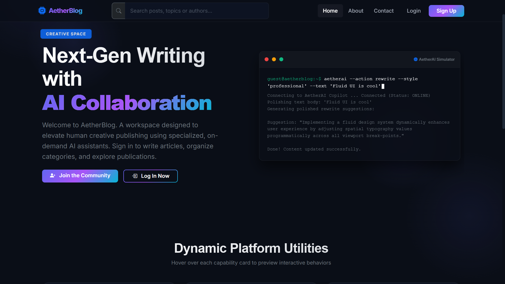
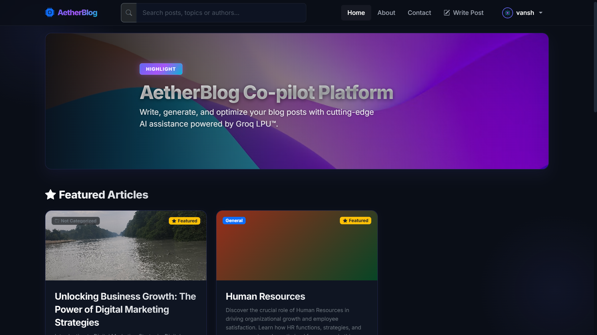
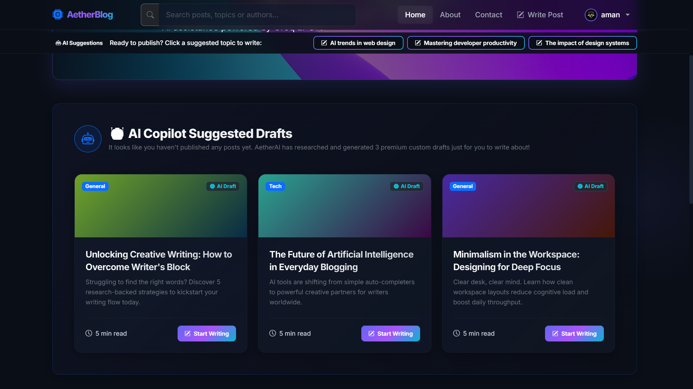
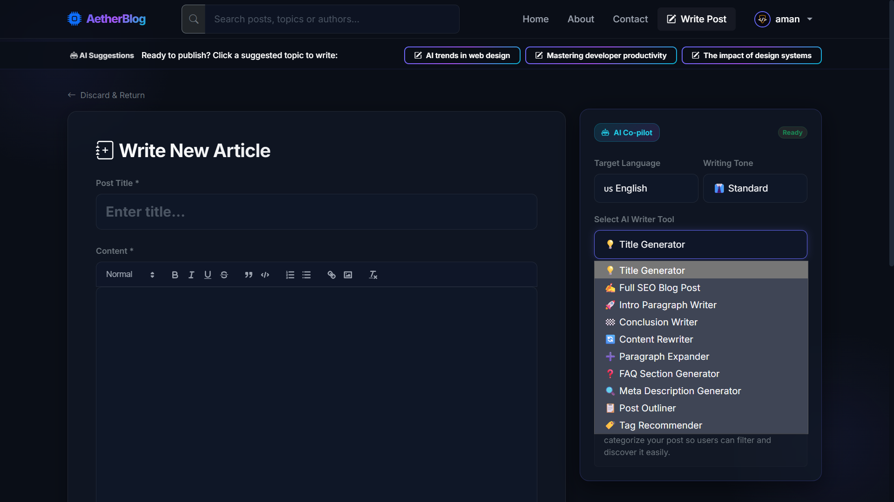
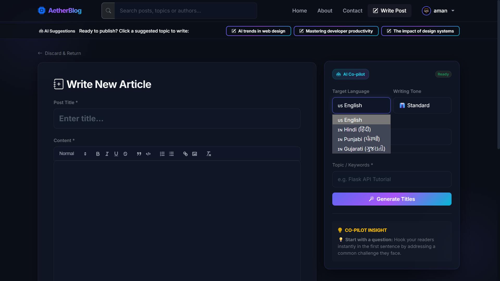
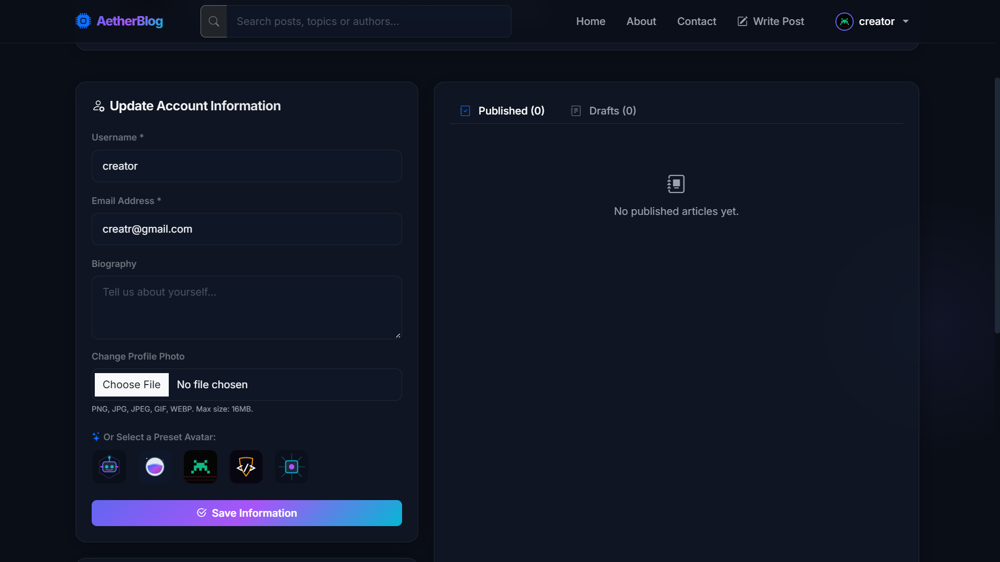
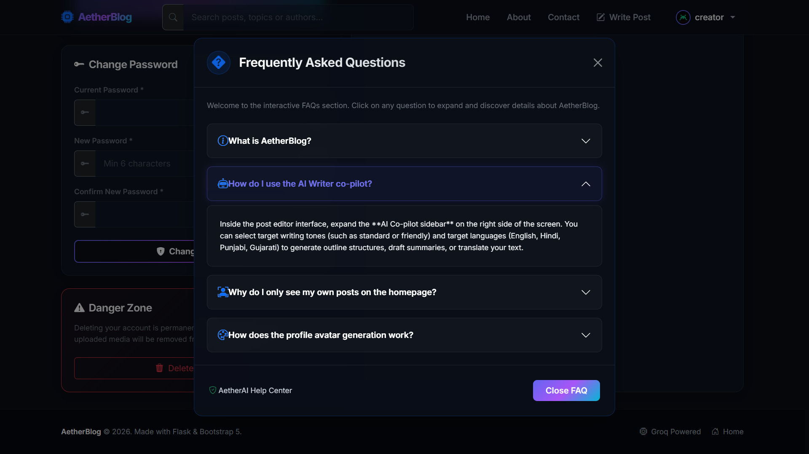
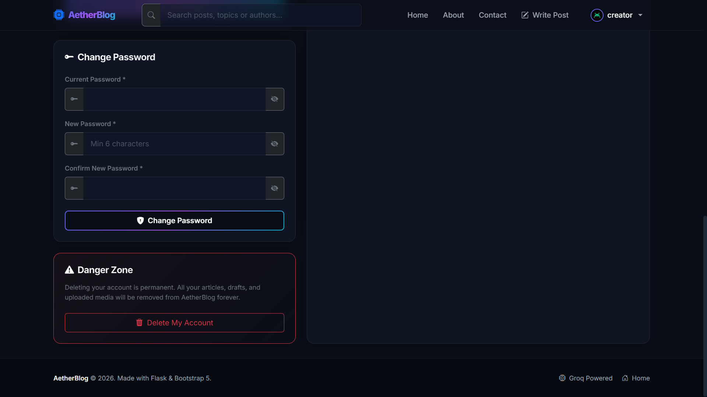
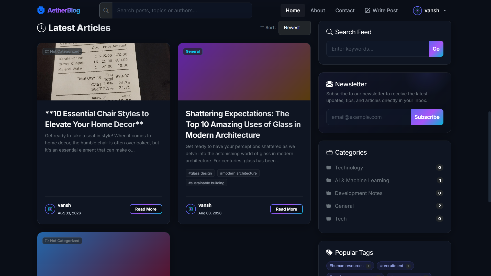

<div align="center">

# 🌌 AetherBlog — AI-Copiloted Next-Gen Blogging Platform

### *Where Human Creativity Meets Intelligent AI Collaboration*

[](https://www.python.org/)
[](https://flask.palletsprojects.com/)
[](https://groq.com/)
[](https://www.sqlalchemy.org/)
[](https://getbootstrap.com/)
[](LICENSE)

<br/>

<!-- ========================================== -->
<!-- 📸 SCREENSHOT SLOT 1: HERO / LANDING PAGE -->
<!-- Replace 'docs/screenshots/landing_page.png' with your screenshot file -->
<!-- ========================================== -->
<p align="center">
  
  <br/>
  <em>✨ Figure 1: Futuristic Glassmorphic Landing Page with Interactive Terminal AI Simulator</em>
</p>

</div>

---

## 📖 Table of Contents

- [🌟 Overview](#-overview)
- [🖼️ Visual Showcase & Screenshots](#️-visual-showcase--screenshots)
- [✨ Key Features](#-key-features)
  - [🤖 AI Writing Co-Pilot (Groq LPU)](#-ai-writing-co-pilot-groq-lpu)
  - [🛡️ Authentication & Partitioned User Experience](#️-authentication--partitioned-user-experience)
  - [🎨 Glassmorphic UI/UX & Micro-Interactions](#-glassmorphic-uiux--micro-interactions)
  - [📝 Content & Media Management](#-content--media-management)
  - [📊 Admin Control Center](#-admin-control-center)
  - [🌐 SEO & Web Performance Suite](#-seo--web-performance-suite)
- [🏗️ System Architecture & Project Structure](#️-system-architecture--project-structure)
- [💻 Tech Stack](#-tech-stack)
- [🚀 Quickstart & Installation](#-quickstart--installation)
- [⚙️ Environment Configuration](#️-environment-configuration)
- [🧪 Running Automated Tests](#-running-automated-tests)
- [👥 Default Admin Credentials](#-default-admin-credentials)
- [🗺️ Future Roadmap](#️-future-roadmap)
- [📄 License](#-license)

---

## 🌟 Overview

**AetherBlog** is a modern, high-performance web publishing platform designed to bridge human storytelling with real-time artificial intelligence. Designed with a **cyberpunk dark-mode glassmorphism aesthetic**, AetherBlog offers an ultra-responsive, immersive writing and reading experience.

Integrated natively with the **Groq LPU™ Cloud API** running `llama-3.3-70b-versatile`, AetherBlog empowers authors to generate structured SEO articles, refine tones, translate content into regional languages in real-time, and overcome writer’s block with zero latency. If an API key is omitted, an intelligent **Offline Fallback Engine** seamlessly takes over, ensuring zero system downtime.

---

## 🖼️ Visual Showcase & Screenshots

> 💡 **Tip for Adding Your Screenshots**: 
> Drop your image files into the [`docs/screenshots/`](docs/screenshots/) folder matching the file names listed below. If your file names differ, simply update the `src="..."` paths in this section.

<br/>

### 1. Hero Landing Page & Typewriter Terminal
Welcomes visitors with a live typewriter AI workflow simulator, interactive post preview locks, and neon accents.

<!-- ========================================== -->
<!-- 📸 SCREENSHOT SLOT 1: HERO / LANDING PAGE -->
<!-- ========================================== -->
<p align="center">
  
  <br/>
  <sub><b>Landing Page</b> — Public interface showcasing simulated AI generation scenarios and blur-on-hover preview cards.</sub>
</p>

---

### 2. Personalized Author Home Dashboard
Authenticated dashboard filtered exclusively to the logged-in user's own articles, category folders, tag clouds, and featured highlight carousel.

<!-- ========================================== -->
<!-- 📸 SCREENSHOT SLOT 2: AUTHOR DASHBOARD -->
<!-- ========================================== -->
<p align="center">
  
  <br/>
  <sub><b>Home Feed Dashboard</b> — Personalized workspace with banner carousel, search filter, and category post counters.</sub>
</p>

---

### 3. Zero-Post State with AI Suggestions
When a new user hasn't published any articles yet, AetherBlog automatically generates 3 creative AI draft suggestions with 1-click editor pre-filling, complemented by a sticky suggested topics sub-navbar.

<!-- ========================================== -->
<!-- 📸 SCREENSHOT SLOT 3: AI ONBOARDING SUGGESTIONS -->
<!-- ========================================== -->
<p align="center">
  
  <br/>
  <sub><b>New User Onboarding</b> — Dynamic AI draft cards and top topics sub-navbar guiding first-time authors.</sub>
</p>

---

### 4. AI Writing Co-Pilot Studio (Post Editor)
The full-featured writing studio equipped with Quill WYSIWYG editing tools and an intelligent sidebar that generates titles, outlines, conclusions, and tags on demand.

<!-- ========================================== -->
<!-- 📸 SCREENSHOT SLOT 4: AI COPILOT EDITOR -->
<!-- ========================================== -->
<p align="center">
  
  <br/>
  <sub><b>Writing Studio</b> — Comprehensive editor paired with 12 AI assistant tools and animated writing tips.</sub>
</p>

---

### 5. Multi-Language Real-Time Translation & Tone Controls
Translate articles seamlessly between English, Hindi (हिंदी), Punjabi (ਪੰਜਾਬੀ), and Gujarati (ગુજરાતી) while preserving HTML formatting, with writing tone switches between Standard and Friendly.

<!-- ========================================== -->
<!-- 📸 SCREENSHOT SLOT 5: TRANSLATION & TONE CONTROLS -->
<!-- ========================================== -->
<p align="center">
  
  <br/>
  <sub><b>Localization Engine</b> — Instant translation into native regional scripts with HTML structure preservation.</sub>
</p>

---

### 6. User Profile, Preset SVG Avatars & Danger Zone
Manage account credentials, choose from 5 futuristic SVG vector avatars, and view user statistics with safe account self-deletion modal triggers.

<!-- ========================================== -->
<!-- 📸 SCREENSHOT SLOT 6: USER PROFILE & AVATARS -->
<!-- ========================================== -->
<p align="center">
  
  <br/>
  <sub><b>Account Settings</b> — Procedural and preset avatar picker, security tabs, and account deletion confirmation.</sub>
</p>

---

### 7. Interactive FAQs Modal with Glowing Accordions
Glassmorphic FAQ modal accessible directly from the navbar with high-contrast glowing accordion cards.

<!-- ========================================== -->
<!-- 📸 SCREENSHOT SLOT 7: FAQS MODAL -->
<!-- ========================================== -->
<p align="center">
  
  <br/>
  <sub><b>Interactive FAQs</b> — Glowing modal with slide-down collapsible cards explaining key platform capabilities.</sub>
</p>

---

### 8. Account Security & Permanent Account Deletion (Danger Zone)
Manage account passwords with interactive visibility toggles and perform safe cascading account self-deletion through a glassmorphic warning modal.

<!-- ========================================== -->
<!-- 📸 SCREENSHOT SLOT 8: ACCOUNT SECURITY & DANGER ZONE -->
<!-- ========================================== -->
<p align="center">
  
  <br/>
  <sub><b>Account Security</b> — Password eye toggles, credential updates, and permanent account self-deletion modal.</sub>
</p>

---

### 9. Dynamic Article Feed, Real-Time Search & Category Taxonomy
Interactive article stream with keyword search, newsletter subscriptions, categorized post counters, and popular tag clouds.

<!-- ========================================== -->
<!-- 📸 SCREENSHOT SLOT 9: ARTICLE FEED & TAXONOMY -->
<!-- ========================================== -->
<p align="center">
  
  <br/>
  <sub><b>Article Stream</b> — Live search query filtering, responsive article cards, and category/tag navigation sidebar.</sub>
</p>

---

## ✨ Key Features

### 🤖 AI Writing Co-Pilot (Groq LPU)
- **12 Dedicated AI Actions**:
  1. **Catchy Title Generator**: Suggests 5 SEO-optimized titles based on topics or keywords.
  2. **SEO Post Writer**: Generates rich, structured HTML content bodies matching given titles and tags.
  3. **Hook Introductions**: Drafts captivating, high-retention opening paragraphs under 150 words.
  4. **Memorable Conclusions**: Writes actionable conclusions with strong Call-to-Actions (CTAs).
  5. **Smart Draft Rewriter**: Polishes existing drafts for clarity, engagement, and tone consistency.
  6. **Content Expander**: Adds descriptive detail and context to selected sentences or paragraphs.
  7. **FAQ Generator**: Extracts 3–5 relevant Q&As from content and formats them in styled HTML.
  8. **Meta Description Generator**: Produces click-worthy SEO snippets capped at 160 characters.
  9. **Structured Outline Builder**: Generates markdown outlines with structural tips.
  10. **2-Sentence Summarizer**: Synthesizes concise hooks under 300 characters for feed previews.
  11. **SEO Tag Extractor**: Recommends 3–5 relevant lowercase keyword tags automatically.
  12. **Native Language Translation**: Real-time translation to **Hindi (हिंदी)**, **Punjabi (ਪੰਜਾਬੀ)**, and **Gujarati (ગુજરાતી)** while preserving HTML elements.
- **Tone Personalization**: Switch effortlessly between **Standard (Professional)** and **Friendly (Approachable/Conversational)** writing styles.
- **Offline Resilience**: Automatically falls back to mock generators if the Groq API key is absent or unreachable.

---

### 🛡️ Authentication & Partitioned User Experience
- **Protected Content Access**: Unauthenticated visitors are guided to a high-converting landing page; all internal posts, tags, and category routes require authentication.
- **Strict User Partitioning**: Every logged-in user experiences an author-centric dashboard showing only their published articles, drafts, and statistics.
- **Show/Hide Password Eyes**: Interactive toggles (`bi-eye-fill` / `bi-eye-slash-fill`) with cyan glow triggers across login, registration, and change-password forms.
- **Procedural & Preset SVG Avatars**:
  - Deterministic procedural base64 SVG generator assigns 1 of 5 vector avatars (Neon Robot, Space Astronaut, Retro Game, Code Shield, Silicon Chip) based on username hash.
  - Interactive profile preset selector to pick and save a preferred vector avatar.
- **Permanent Account Deletion (Danger Zone)**: Allows users to securely delete their accounts with a modal warning, triggering SQLAlchemy cascading deletion of all associated posts and comments.

---

### 🎨 Glassmorphic UI/UX & Micro-Interactions
- **Futuristic Dark Palette**: Deep background (`#0a0e17`) paired with neon indigo (`#6366f1`), purple (`#a855f7`), and cyan (`#06b6d4`) accents.
- **Animated Top Progress Bar**: Visual feedback on page navigation and search actions.
- **Auto-Dismissing Flash Alerts**: Flash messages dismiss automatically after 3 to 5 seconds.
- **Micro-Interactions**: Brand logo hover shimmer, smooth card lifts, button scaling, and glowing accordion transitions.
- **Interactive Contact Page Mascots**: Smooth cross-fade card widget on the contact page showcasing Luna the cat and Milo the dog with portrait photography.

---

### 📝 Content & Media Management
- **Quill Rich Text Editor**: Clean WYSIWYG editing with support for headings, bold/italics, quotes, lists, links, and code blocks.
- **Automated Slug Generation**: Generates SEO-friendly URL slugs with UUID conflict resolution.
- **Pillow Image Engine**: Standardizes uploaded cover photos to 1200px width with aspect-ratio preservation and clears unused files upon deletion.
- **Taxonomy Management**: Many-to-many tag associations and categorized post organization.
- **AJAX Comments**: Real-time comment submission without page refresh.

---

### 📊 Admin Control Center
- **Role-Based Protection**: Strict `@admin_required` decorators ensure only administrators access `/admin/`.
- **System Metrics**: Overview counters for total posts, published articles, drafts, categories, banners, users, and contact inquiries.
- **Full CRUD Management**: Manage categories, carousel banners, team members, about page information, and visitor inquiries.

---

### 🌐 SEO & Web Performance Suite
- **Dynamic XML Sitemap**: Generated on the fly at `/sitemap.xml` with change frequencies and priorities for all posts, categories, and tags.
- **Automated robots.txt**: Crawl configuration endpoint at `/robots.txt`.
- **OpenGraph & Social Meta**: Dynamic `og:title`, `og:description`, `og:image`, and Twitter card tags embedded in the base layout.

---

## 🏗️ System Architecture & Project Structure

AetherBlog adheres to the **Model-View-Controller (MVC)** architectural pattern:

```text
blog-system/
├── app/
│   ├── __init__.py              # Application factory, CSRF & LoginManager setup
│   ├── models.py                # SQLAlchemy database models (9 entities)
│   ├── controllers/             # MVC Controllers (Blueprints)
│   │   ├── admin.py             # Admin dashboard & management routes
│   │   ├── ai.py                # Groq completions & AI co-pilot routes
│   │   ├── auth.py              # Login, register, profile, and account deletion
│   │   └── blog.py              # Feeds, editor, comments, contact, and SEO routes
│   ├── utils/                   # Business logic helpers
│   │   ├── ai_suggestions.py    # Zero-post onboarding suggestion generators
│   │   └── image.py             # Pillow upload resizing & cleanup routines
│   ├── views/                   # Jinja2 HTML templates
│   │   ├── admin/               # Admin dashboard templates
│   │   ├── auth/                # Login, register, and profile templates
│   │   ├── blog/                # Landing, index, post, editor, about, contact
│   │   ├── errors/              # 404 and 500 error pages
│   │   └── base.html            # Global layout with glassmorphic navbar & FAQs modal
│   └── static/                  # Static assets
│       ├── css/style.css        # Glassmorphic design tokens & animation rules
│       ├── js/main.js           # Client-side interactivity & AJAX handlers
│       ├── images/              # Preset SVG avatars, mascot photos, default OG
│       └── uploads/             # User-uploaded post cover photos
├── docs/
│   └── screenshots/             # Directory for README screenshots
├── scratch/                     # Test suite (23 automated testing scripts)
├── instance/
│   └── blog.db                  # SQLite database (auto-generated at runtime)
├── .env.example                 # Template for environment variables
├── .env                         # Local environment configuration (git-ignored)
├── requirements.txt             # Python dependencies
├── run.py                       # Dev server runner with self-healing DB seeder
└── README.md                    # Project documentation
```

---

## 💻 Tech Stack

| Layer | Technology | Purpose |
| :--- | :--- | :--- |
| **Language** | Python 3.10+ | Core application runtime |
| **Web Framework** | Flask 3.0.3 | Routing, blueprints, request handling, error boundaries |
| **ORM & Database** | Flask-SQLAlchemy 3.1.1 / SQLite | Relational data persistence with cascading rules |
| **AI Inference** | Groq Cloud API | Ultra-low latency LPU inference with `llama-3.3-70b-versatile` |
| **Authentication** | Flask-Login 0.6.3 | Session management & user loading |
| **Security** | Flask-WTF (CSRF) & Werkzeug | Cross-site request forgery protection & `scrypt` password hashing |
| **Image Processing** | Pillow (PIL) | Automatic dimension standardization and format conversion |
| **Frontend Styling**| Bootstrap 5.3 & Custom CSS3 | Dark glassmorphism, HSL color tokens, animations |
| **Text Editor** | Quill.js | Rich-text WYSIWYG authoring console |
| **Icons** | Bootstrap Icons 1.11 | Modern iconography system |

---

## 🚀 Quickstart & Installation

### 1. Prerequisites
Ensure you have **Python 3.10 or higher** installed on your system.

### 2. Clone the Repository
```bash
git clone https://github.com/your-username/blog-system.git
cd blog-system
```

### 3. Create and Activate a Virtual Environment
- **On Windows (PowerShell):**
  ```powershell
  python -m venv venv
  .\venv\Scripts\Activate.ps1
  ```
- **On macOS / Linux:**
  ```bash
  python3 -m venv venv
  source venv/bin/activate
  ```

### 4. Install Dependencies
```bash
pip install -r requirements.txt
```

### 5. Configure Environment Variables
Copy `.env.example` to create your `.env` file:
```bash
cp .env.example .env
```
Open `.env` and configure your settings:
```ini
FLASK_SECRET_KEY=your_super_secret_key_here
FLASK_DEBUG=True
DATABASE_URL=sqlite:///blog.db
GROQ_API_KEY=your_groq_api_key_here
GROQ_MODEL=llama-3.3-70b-versatile
```
> 🔑 **Groq API Key**: Get a free API key at [console.groq.com](https://console.groq.com/). If omitted, the app will run with offline mock AI generators.

### 6. Start the Application
```bash
python run.py
```
> The startup script automatically initializes the database tables, applies self-healing column migrations, seeds default categories, banners, and an admin user, and launches the server:
> 
> 🌐 **App URL**: [http://127.0.0.1:5000](http://127.0.0.1:5000)

---

## ⚙️ Environment Configuration

| Variable | Default Value | Description |
| :--- | :--- | :--- |
| `FLASK_SECRET_KEY` | `dev_secret_key` | Secret key used for session cryptographic signing. |
| `FLASK_DEBUG` | `True` | Enables Flask auto-reloading and debug traceback mode. |
| `DATABASE_URL` | `sqlite:///blog.db` | Connection string for SQLAlchemy (supports SQLite, Postgres, MySQL). |
| `GROQ_API_KEY` | *None* | Authentication token for Groq LLM inference. |
| `GROQ_MODEL` | `llama-3.3-70b-versatile` | LLM model identifier for Groq completions. |

---

## 🧪 Running Automated Tests

The project includes **23 comprehensive test scripts** in the `scratch/` directory verifying authentication, AI actions, search, author partitioning, image handling, responsive layouts, and SEO endpoints:

```bash
# Run the entire test suite via Python unittest discovery:
python -m unittest discover -s scratch -p "test_*.py"

# Or run individual feature tests:
python scratch/test_ai_lang_tone.py
python scratch/test_delete_account.py
python scratch/test_user_filtering_and_suggestions.py
```

---

## 👥 Default Admin Credentials

Upon initial database initialization, a default administrative account is automatically seeded:

- **Username**: `aether_system`
- **Email**: `system@aetherblog.dev`
- **Password**: `aether_secure_pass_9988`
- **Admin Dashboard**: Accessible at `/admin` when logged in as this account.

> ⚠️ *Remember to update the default password or create your own admin account before deploying to production.*

---

## 🗺️ Future Roadmap

- [ ] **Collaborative Live Editing**: Real-time multi-author drafting using WebSockets.
- [ ] **Cloud Asset Storage**: Direct S3 / Cloudinary image uploads for distributed architectures.
- [ ] **PostgreSQL Migration Support**: Dockerized production deployment with PostgreSQL.
- [ ] **Reading Analytics**: Read time estimations and engagement metrics for authors.
- [ ] **Audio Article Generator**: Text-to-speech narration of published posts using AI voice models.

---

## 📄 License

This project is licensed under the **MIT License** — feel free to use, modify, and distribute it for personal and commercial projects.

<div align="center">
  <sub>Built with ❤️ and powered by Flask & Groq AI.</sub>
</div>
