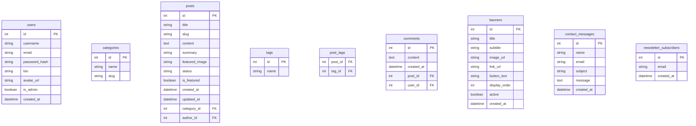

# AetherBlog — AI-Co-piloted Blogging Platform
## Comprehensive Project Report & Technical Documentation

---

## 1. Project Description & Overview

**AetherBlog** is a state-of-the-art, high-performance web-based blog management system designed to bridge the gap between traditional content creation and modern artificial intelligence. It features a sleek, premium, dark-mode user interface utilizing **glassmorphism**, glowing borders, and responsive grid layouts. Under the hood, it leverages a clean **Model-View-Controller (MVC)** architectural pattern built using the **Flask** micro-framework in Python.

The central pillar of AetherBlog is its deep integration with the **Groq LPU™ (Language Processing Unit) Cloud completions API**, deploying large language models (such as `llama-3.3-70b-versatile`) directly into the editing workspace. This allows authors to generate ideas, draft content, refine style tone, and instantly translate posts into native regional scripts in real-time. If an API key is missing or internet connection is lost, the platform gracefully switches to an intelligent **Offline Fallback Engine** ensuring uninterrupted workflows.

With robust database relationships, an administrative control panel, secure authentication sessions, and dynamic user onboarding suggestions, AetherBlog represents a secure, scalable, and highly interactive blogging platform.

---

## 2. System Architecture & Tech Stack

AetherBlog follows a strict Model-View-Controller (MVC) architectural pattern. Below is a structured summary of the project's technical stack:

### Tech Stack Summary Table

| Component | Technology | Version | Scope / Purpose | Key Files & Entry Points |
| :--- | :--- | :--- | :--- | :--- |
| **Language** | Python | `3.x` | Core application logic, script seeding, utility wrappers | `run.py`, `app/**/*.py` |
| **Web Framework** | Flask | `3.0.3` | App routing, request contexts, Blueprints registration, custom template filters | [`app/__init__.py`](file:///c:/Users/ASUS/OneDrive/Desktop/blog-system/app/__init__.py) |
| **Database Engine** | SQLite | `3.x` | Relational, file-based data storage | `instance/blog.db` (generated at runtime) |
| **ORM Wrapper** | Flask-SQLAlchemy | `3.1.1` | SQL mapping, database schemas, foreign-key constraint enforcement | [`app/models.py`](file:///c:/Users/ASUS/OneDrive/Desktop/blog-system/app/models.py) |
| **Auth System** | Flask-Login | `0.6.3` | Session management, active user loading, login/logout context | [`app/controllers/auth.py`](file:///c:/Users/ASUS/OneDrive/Desktop/blog-system/app/controllers/auth.py) |
| **Secured Cryptography**| Werkzeug Security | Built-in | Password hashing (`scrypt`) and verification | [`app/models.py`](file:///c:/Users/ASUS/OneDrive/Desktop/blog-system/app/models.py) |
| **AI Inference** | Groq completions API | `v1` | Real-time structured LLM inference (`llama-3.3-70b-versatile`) | [`app/controllers/ai.py`](file:///c:/Users/ASUS/OneDrive/Desktop/blog-system/app/controllers/ai.py), [`app/utils/ai_suggestions.py`](file:///c:/Users/ASUS/OneDrive/Desktop/blog-system/app/utils/ai_suggestions.py) |
| **Image Processing** | Pillow (PIL) | standard | Upload validation, image resizing, color conversion | [`app/utils/image.py`](file:///c:/Users/ASUS/OneDrive/Desktop/blog-system/app/utils/image.py) |
| **Frontend Styling** | Bootstrap 5 & CSS3 | `5.3` / Custom | Responsive grid layouts, glassmorphism, animations, glow shadows | [`app/static/css/style.css`](file:///c:/Users/ASUS/OneDrive/Desktop/blog-system/app/static/css/style.css) |
| **Frontend Logic** | Javascript (ES6) | Native | AJAX requests, typewriter simulation, tip slider, password togglers | [`app/static/js/main.js`](file:///c:/Users/ASUS/OneDrive/Desktop/blog-system/app/static/js/main.js) |
| **Config Loader** | python-dotenv | `1.0.1` | Environment variable extraction from `.env` configurations | [`.env`](file:///c:/Users/ASUS/OneDrive/Desktop/blog-system/.env) |

### Detailed Component Specifications

*   **Backend Core (Flask 3.0.3)**: Handles URL mapping through Blueprints (`auth`, `blog`, `ai`, `admin`), error pages (404, 500, 413 file size limits), custom template date-format filters, and sets upload limits (16MB maximum request payload).
*   **Database Schema & ORM (Flask-SQLAlchemy 3.1.1)**: Manages relations between nine tables with cascading deletions. The SQLite engine is initialized dynamically via `db.create_all()` in `run.py`, featuring self-healing migration checks that execute `ALTER TABLE ADD COLUMN` statements on server boot.
*   **User Security & Authentication (Flask-Login 0.6.3 & CSRFProtect)**: Isolates route permissions (e.g. `@login_required` and custom admin wrappers `@admin_required`), protects forms against Cross-Site Request Forgery (CSRF), and validates input security.
*   **AI Co-pilot Engine (Groq v1 API & Llama-3.3)**: Connects to Groq's high-speed completion endpoints over HTTPS, structuring strict temperature parameters (0.5 for stability, 0.7 for prompts) to request JSON formats or raw text. It includes a fallback engine with local pre-built blog templates and topic lists.
*   **Image Processing Engine (Pillow/PIL)**: Captures uploaded pictures via multipart forms, validates extension categories (PNG, JPG, JPEG, GIF, WEBP), resizes wide headers to a standard 1200px width keeping the aspect ratio, converts RGBA channels to RGB to avoid format discrepancies, and saves them with unique UUID filenames.
*   **Frontend UI Design System (CSS3 & Javascript)**: An interactive theme built upon customized design tokens (HSL indigo/purple/cyan accents), frosted-glass navbar filters (`backdrop-filter`), CSS variables, custom keyframe animations, typewriter simulators, and clean dynamic inputs.

---

## 3. Comprehensive Feature Analysis

AetherBlog contains a rich set of features tailored for content writers and site administrators alike:

### 3.1. Secure Authentication & Profile Settings
*   **Register & Login**: Hashed password storage with verification checks. Includes input validations for emails (RegEx) and minimum password length boundaries.
*   **Password Toggle**: Interactive show/hide password buttons represented by eye icons on all login, registration, and change-password inputs.
*   **Custom Avatar Management**: Users can upload custom images (PNG, JPG, WebP, GIF format with automatic size limits up to 16MB) or choose from five preset custom vector avatars.
*   **Procedural Neon Avatar Fallback**: In the absence of an avatar, an offline-safe base64 SVG generator assigns one of 5 technical/cyberpunk vector profiles (Cyberpunk Neon Robot, Sci-Fi Space Helmet, Retro Game Controller, Code Bracket Shield, or Tech Chip Processor) determined deterministically by the hash of the user's username.
*   **Account Self-Deletion (Danger Zone)**: Fully featured profile deletion option that asks for confirmation via a premium glassmorphic modal before purging all user records, posts, comments, and assets from the SQLite database.

### 3.2. AI-Powered Writing Co-pilot (Groq Engine)
Located inside the post editor's sidebar, the AI Co-pilot contains twelve distinct capabilities that dynamically read or prefill inputs:
1.  **Catchy Title Generator**: Generates 5 SEO-optimized, engaging titles from topics or target keywords.
2.  **SEO Post Writer**: Automatically generates complete structured post bodies in clean HTML tags matching the active title and keywords.
3.  **Hook Introduction Generator**: Writes engaging introduction paragraphs (under 150 words).
4.  **Memorable Conclusion Generator**: Crafts concise conclusions complete with Calls to Action (CTA) based on existing content.
5.  **Smart Draft Rewriter**: Refines and polishes written drafts to enhance engagement, clarity, and grammatical flow.
6.  **Content Expander**: Adds descriptive detail, context, and technical explanations to highlighting segments.
7.  **FAQ Generator**: Creates 3 to 5 relevant Frequently Asked Questions in structured markup based on the article's text.
8.  **Meta Description Generator**: Outputs SEO-friendly page description snippets capped at 160 characters.
9.  **Blog Outline Generator**: Structures a detailed outline using markdown headers and structural guide notes.
10. **2-Sentence Summary Synthesizer**: Produces a summary under 300 characters for card previews.
11. **SEO Tag Recommender**: Analyzes text to recommend 3-5 relevant lowercase tags.
12. **Context-Aware Translation**: Translates text into Hindi (हिंदी), Punjabi (ਪੰਜਾਬੀ), or Gujarati (ગુજરાતી) while preserving original HTML structure and markdown delimiters.

*   **Tone Adjustment Controls**: Allows users to override generation parameters, switching the AI output between a standard professional tone or a warm, casual, and friendly writing style.
*   **Auto-Translation Listener**: Triggers automatic translation of both titles and contents instantly when the writer modifies the target language dropdown list.
*   **Writing Tips Rotator**: Displays a sliding tip rotation card within the editor that guides writers on how to utilize AI parameters effectively.

### 3.3. Content Management System (CMS) & Feed Filters
*   **Drafts vs. Published Status**: Post visibility toggle. Drafts are private and only viewable by their author.
*   **Featured Articles**: Allows flagging of important posts. Homepage filters display up to 3 featured articles in a top carousel slider, with a "See More" page at `/featured` displaying all featured items.
*   **Search & Search Validations**: Robust keyword query matching title, body content, categories, tags, or author usernames. Visitors are prompted to sign in to execute searches, displaying a temporary Bootstrap card notification rather than generic browser popups.
*   **Sidebar Navigation Widgets**: Displays dynamic category folders showing the count of published posts and popular tags sorted by utilization frequency.
*   **Author-Centric Home Dashboard**: Restricts homepage listings, recent posts lists, and tags strictly to the logged-in user's content to keep workspace boards focused.
*   **Zero-Post Onboarding Suggestions**: When an active writer has 0 posts, AetherBlog automatically generates three custom mock articles using Groq (or fallback templates) in a suggested dashboard feed, enabling a "Start Writing" action that pre-populates the editor.
*   **Suggested Topics Bar**: Displays three top writing ideas inside a suggested sub-navbar at the top of the viewport when a user has no posts.
*   **Interactive Comments**: AJAX-enabled comments posting interface that inserts comments immediately into the post view without reloading the active web page.

### 3.4. Administrative Control Panel
Users with `is_admin=True` gain access to the `/admin/` prefix path featuring:
*   **Platform Dashboard Metrics**: Summary statistics (Total Users, Banners, Categories, Messages, and Post Status distributions).
*   **Categories CRUD**: Create, edit, and delete category listings (with self-healing fallback options replacing deleted categories with a "Not Categorized" badge on posts).
*   **Homepage Banners**: Upload and manage carousel graphics, titles, sub-headers, redirection hyperlinks, button texts, and display priority order.
*   **User Inquiries Inbox**: Read messages submitted via the Contact form.

---

## 4. Database Schema Structure

AetherBlog employs an SQLite database containing nine primary relational entities:

---

## 5. Pros and Cons of AetherBlog

### Pros (Advantages)
1.  **Sophisticated Modern Aesthetics**: The dark glassmorphic design system is visually striking. Glowing elements, micro-interactions (hover translations, brand shimmers), and smooth animations create a premium user experience.
2.  **High-Speed AI Writing Co-Pilot**: By leveraging Groq’s LPU API, response latencies for summaries, translations, and expansions are under a second, resolving the slow-generation issues common with standard LLM providers.
3.  **Graceful Degredation (Offline Support)**: If api keys are absent, the application doesn't break. The mock suggestions engine provides placeholders that demonstrate the capabilities of the editor.
4.  **Clear Code Separation (MVC)**: Code readability is high. Database models, static assets, and distinct controllers are separated into independent Flask blueprints (admin, AI, auth, blog).
5.  **Self-Healing Database Migrations**: The database loader auto-patches SQLite tables at startup, applying `ALTER TABLE` operations if updates add columns to schemas, reducing system configuration drift.
6.  **Secure Framework Practices**: Implementation includes Werkzeug password security, CSRF token verification on forms, error page overrides (404, 500, 413), and protection against open-redirect phishing attacks.

### Cons (Disadvantages & Limitations)
1.  **File System Database Locking (SQLite)**: SQLite is locked to a single file, making it unsuitable for high concurrent write volumes or multi-instance load-balanced servers.
2.  **External API Dependency**: Core AI features are reliant on the availability of Groq services. Network failures or API key expiration limit the editor's live functionalities.
3.  **State Management Constraints**: Real-time translations are processed by translating the entire title and body blocks in one request. For massive articles, this could exceed API payload boundaries.
4.  **Lack of Visual WYSIWYG Editor**: While content is generated with structural HTML tags (e.g. `<h3>`, `
`), the writing console is a standard textarea element rather than a visual rich-text block (like TinyMCE or Editor.js).
5.  **Missing Global Moderation Checks**: Although users are isolated and only view their own content on the home feeds, there are no built-in toxicity detectors or manual comment approvals for open forums.

---

## 6. Target Application Areas & Use Cases

AetherBlog is well-suited for several practical deployment scenarios:

*   **Personal Creative Writing & Blogs**: Ideal for individual technical writers, journalists, or content creators who want an integrated tool to help overcome writer's block, draft structural outlines, and suggest tags.
*   **Regional Content Localization Platforms**: Excellent for multi-lingual websites that require immediate translation of technology digests into Hindi, Punjabi, or Gujarati scripts without using heavy separate translation plugins.
*   **Educational Demo Material**: The clean separation of models, templates, blueprints, and database initializers makes this project a gold standard resource for teaching modern MVC design patterns, Flask development, and RESTful API integrations.
*   **Rapid Prototyping CMS**: Can serve as a template platform for SaaS startups aiming to test market responses to automated writing dashboards.

---

## 7. Future Scope & Roadmap

To expand AetherBlog into a larger, enterprise-grade application, the following updates are planned:

1.  **Visual WYSIWYG Editor**: Integrate an interactive text component (e.g., Quill or TipTap) to allow authors to format text visually instead of typing or reading raw HTML tags.
2.  **PostgreSQL or MySQL Integration**: Provide built-in support for centralized database hosts, enabling AetherBlog to be containerized and run on cloud platforms (such as Kubernetes or AWS ECS) with multiple instances running concurrently.
3.  **Advanced Media Manager**: Build a gallery interface where authors can organize, crop, compress, and search uploaded cover photos and assets instead of relying on individual folder upload paths.
4.  **Collaborative Editing via WebSockets**: Add real-time multi-user document collaboration so multiple writers can edit drafts simultaneously.
5.  **SEO Analytics Dashboard**: Incorporate simple charts displaying traffic performance, click rates, and read durations, alongside automated page crawling analysis indicating missing metadata tags or image descriptors.

---

## 8. Bibliography & References

1.  **Flask Framework Documentation**: [https://flask.palletsprojects.com/](https://flask.palletsprojects.com/)
2.  **SQLAlchemy ORM Documentation**: [https://www.sqlalchemy.org/](https://www.sqlalchemy.org/)
3.  **Groq API Completions Hub**: [https://console.groq.com/docs](https://console.groq.com/docs)
4.  **Bootstrap 5 Utilities Reference**: [https://getbootstrap.com/docs/5.3/getting-started/introduction/](https://getbootstrap.com/docs/5.3/getting-started/introduction/)
5.  **Pillow Image Library Documentation**: [https://pillow.readthedocs.io/en/stable/](https://pillow.readthedocs.io/en/stable/)
6.  **Werkzeug Security Core**: [https://werkzeug.palletsprojects.com/en/3.0.x/utils/#module-werkzeug.security](https://werkzeug.palletsprojects.com/en/3.0.x/utils/#module-werkzeug.security)
7.  **Jinja2 Template Engine Documentation**: [https://jinja.palletsprojects.com/](https://jinja.palletsprojects.com/)
